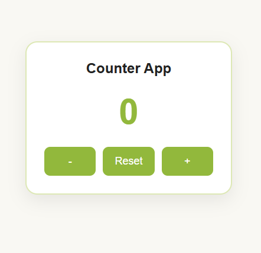

# Counter App

A simple counter built with vanilla HTML, CSS, and JavaScript — no frameworks, just the basics done right. I built this while getting comfortable with DOM manipulation and event-driven UI updates.



Live demo: [https://countmonitor.netlify.app/]

## Features

- Increment / decrement / reset counter
- Responsive layout, works on mobile
- Keyboard support (optional — remove if you didn't add this)
- No dependencies, pure JS

## Tech Stack

HTML5, CSS3, JavaScript (ES6)

## Project Structure

```
Counter-App/
├── index.html
├── style.css
├── script.js
├── assets/
└── README.md
```

## Running Locally

```bash
git clone https://github.com/chitrangna-dev/Counter-App.git
cd Counter-App
```

Just open `index.html` in your browser — no build step needed.

## What I Learned

This was a small project, but a few things stuck with me:

- Using event delegation instead of attaching listeners to every button
- Keeping the counter value in a single source of truth instead of reading it back from the DOM each time
- Debouncing rapid clicks so the counter doesn't jump when a button is spammed
- Writing CSS that scales down cleanly on smaller screens using `clamp()` and flexbox instead of fixed breakpoints

## Possible Improvements

- Add a step-size input (increment by 2, 5, etc.)
- Persist the count using localStorage
- Add a max/min limit with a visual warning

## Connect

- GitHub: [chitrangna-dev](https://github.com/chitrangna-dev)
- LinkedIn: []
